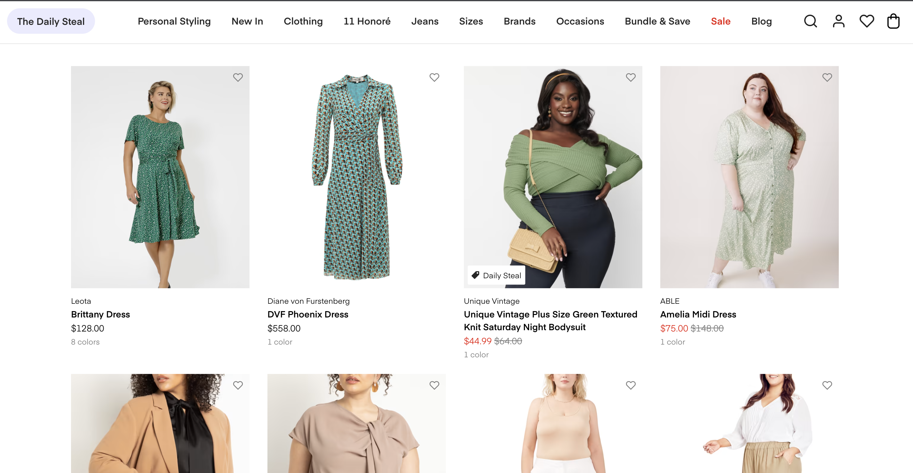
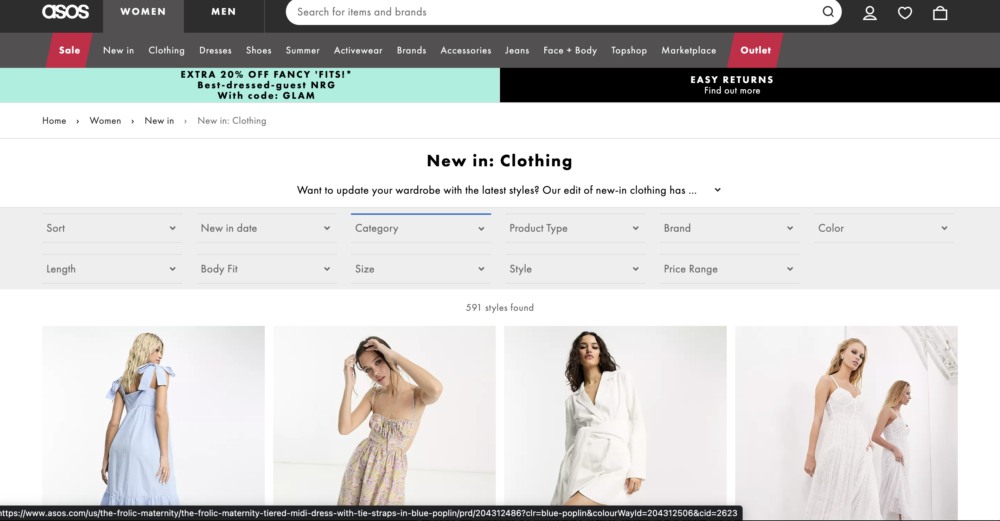

# Easy and Fast Data extraction

Hidden API with Requests and Scrapy

## Introduction

In this repo I expose different methods to extract data using hidden or internal APIs present on dynamic sites without having to use scraping programs that simulate javascript.
I choose to use `Requests`, `Scrapy`  and only `json`

The data was extracted from 3 fashion sites :

- [Banana Repulic](https://bananarepublic.gap.com/)
- [Shop Dia](https://shop.dia.com/)
- [Asos](https://www.asos.com/)

---

### Banana republic

 

### Shop Dia

 

### Asos

 

Images extractions with Scrapy

 

